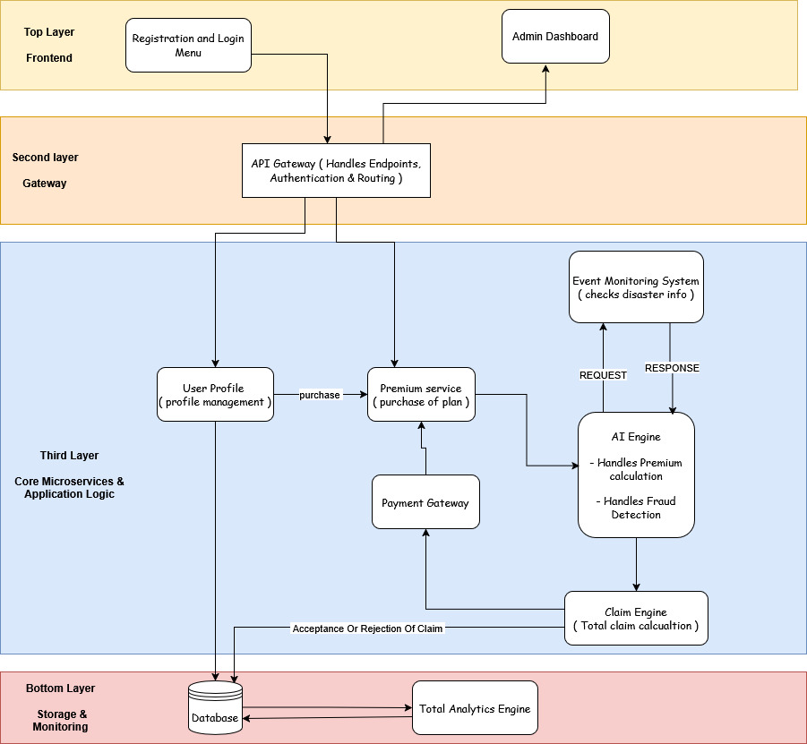

# GigInsure  
AI-powered income protection for food delivery workers  

---

## Problem  

Food delivery partners earn only when they are working.  
If external conditions like heavy rain, floods, extreme heat, or pollution occur, they simply cannot work.

When they don’t work, they don’t earn.

Right now, there is no system that protects them from this kind of income loss.

---

## Scenario  

Ravi is a Swiggy delivery partner in Chennai whose income depends entirely on daily work availability.  
During disruptions like heavy rain, his earnings drop significantly.

On a normal day:
- Earns around ₹500  
- Completes 15–20 deliveries  

During heavy rain:
- Roads become unsafe  
- Restaurants close early  
- Orders drop  

### Daily Impact

| Condition    | Daily Earnings | Deliveries |
|-------------|--------------|-----------|
| Normal Day  | ₹500         | 15–20     |
| Heavy Rain  | ₹0–₹200      | Very low  |

> His daily income drops drastically during disruptions.

### Weekly Impact

| Metric           | Value |
|-----------------|------|
| Expected Income | ₹3000 |
| Actual Income   | ₹1000 |
| **Loss**        | **₹2000** |

> This loss is caused by **external disruptions**, not user behavior.

---

## What We Are Building  

GigInsure is a simple system that gives gig workers a safety net for income loss.

Instead of asking users to file claims manually, the system:
- monitors real-world conditions  
- detects disruptions  
- automatically triggers payouts  

The user does not need to take any action.

---

## How It Works  

1. User registers with location and platform  
2. System calculates risk and suggests a weekly plan  
3. User buys the plan  
4. Coverage becomes active  

After that:

- System continuously monitors weather, AQI, and alerts  
- If disruption happens → claim is triggered automatically  
- Fraud checks are applied  
- Payout is processed  
- Dashboard is updated  

---

## System Architecture  

  

The system uses real-time environmental data to trigger claims automatically, 
while a multi-layer fraud detection engine assigns a risk score before payout.

## Weekly Premium Model  

We use a weekly model because gig workers operate week-to-week.

Plans:

- ₹15 → coverage up to ₹500  
- ₹20 → coverage up to ₹800  
- ₹25 → coverage up to ₹1200  

Premium is adjusted slightly based on:
- location  
- historical disruption patterns  

Higher-risk areas may have slightly higher premiums.

---

## Parametric Triggers  

Claims are triggered automatically using real-world data.

We monitor:

- Rainfall  
- Temperature  
- Air Quality Index  
- Flood alerts  

Examples:

- Heavy rain → rainfall above threshold  
- Extreme heat → temperature above limit  
- Pollution → AQI hazardous  
- Flood → official alert  

Once triggered:
- system detects disruption  
- claim is generated  
- payout is processed  

---

## AI / ML Integration  

### Premium Calculation  

We estimate risk using:
- location  
- historical weather data  
- disruption frequency  

This helps in setting fair weekly pricing.

---

### Fraud Detection  

We check:
- mismatch between claim and actual data  
- repeated claims  
- unusual patterns  

This is done using simple anomaly detection and rule-based checks.

---

## Platform Choice  

We chose a web application because:
- faster to build within hackathon time  
- works on mobile and desktop  
- no installation required  
- easy to demonstrate  

---

## Tech Stack  

Frontend: React + Tailwind  
Backend: FastAPI  
Database: PostgreSQL  
AI/ML: Scikit-learn  
APIs: Weather + AQI  
Payments: Razorpay (sandbox)  
Deployment: Vercel / Render  

---

## Development Plan  

Phase 1:
- problem understanding  
- system design  
- basic UI  

Phase 2:
- user registration  
- policy system  
- premium calculation  
- claim automation  

Phase 3:
- fraud detection  
- payout simulation  
- dashboard  

---

## 🚨 Adversarial Defense & Anti-Spoofing Strategy  

### Problem  

Fraud rings can spoof GPS locations to fake being in a disruption zone and trigger false payouts.

Simple GPS verification is not reliable.

---

## 1. Differentiation: Real vs Fake  

We do not rely only on GPS.  
We check multiple signals together.

Real users show:
- natural movement  
- realistic behavior  
- environment consistency  

Fake users show:
- static or unnatural movement  
- mismatched data  

---

### Signals Used  

- Location history (not just one point)  
- Movement patterns  
- Time-based activity  
- Network conditions  
- Environmental data  

---

## 2. Data for Fraud Detection  

### User-Level  

- GPS history  
- movement path  
- claim frequency  

---

### Environmental  

- weather data  
- AQI  
- alerts  

---

### Device / Network  

- IP patterns  
- device identifiers  

---

### Group Behavior (important)  

We detect coordinated attacks:

- many users claiming from same location  
- sudden spike in claims  
- identical behavior patterns  

---

## 3. Defense Strategy  

We use layered validation:

### Layer 1: Real-time checks  
Compare GPS, movement, and environment  

### Layer 2: Behavior analysis  
Compare with past activity  

### Layer 3: Cluster detection  
Detect group fraud patterns  

---

Each claim is assigned a **risk score (0–1)**.

---

### Action Based on Risk  

- Low risk → instant payout  
- Medium risk → delayed verification  
- High risk → flagged  

---

## 4. User Experience Balance  

We avoid punishing genuine users.

If a claim is flagged:
- it is not rejected immediately  
- moved to verification state  

We may:
- check activity consistency  
- validate against environment  

---

### Principle  

We prefer delaying a payout rather than rejecting a genuine worker.

---

## Final Idea  

GigInsure focuses on one goal:

Helping delivery workers stay financially stable when they cannot work due to external conditions.

It removes the complexity of insurance and makes everything automatic.

---

## Git Repository

https://github.com/Rajbhandari107/GUIDEWIRE-HACKATHON

## Pitch Video Link - 

##TEAM MINI PEKKA
Buddham Rajbhandari, Aayush Pathak, Sneha Shariff, Achyut Poudel, Rahul Purbey
